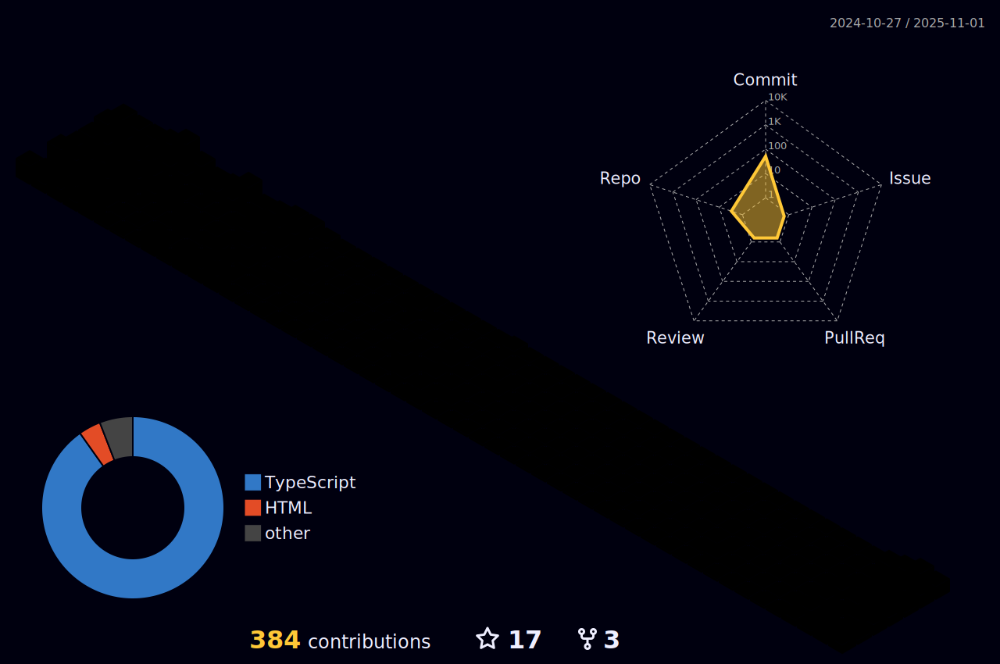

<h1 align="center">Hi There, I'm Feras </h1>

<!--  -->

<h3 align="center">A FullStack Developer Using #Laravel & #Vue</h3>

<!--

-->
 

 

   
   
 
   
   

 
<h1 align="left">About me:</h1>

<!-- ___ -->

<!--- I’m currently working on [PIC](mobp.pic-pal.ps) And [WMIS](https://stage.wmis.live/login)-->

- Most of my projects are available at [https://github.com/ferasbbm](https://github.com/ferasbbm)

- How to reach me **feras.bbm@gmail.com** , **[GitHub Discussion](https://github.com/ferasbbm/ferasbbm/discussions/new?category=general)**

<h1 align="left">Skils:</h1>

<!-- ___ -->

| Props | Value |
|--|--|
| Langs |     |
|Frameworks|    | 
|Famelier| |
|Tools|  |
|Libraries| |
|DBs|  |
|Services|   |
|Platforms|         |
|IDEs| |
|Browsers| |

<h1 align="left"> 
  My Stats:
</h1>

<!-- ___ -->

## Contribution Graph 

## Activity 

  
  
<!--    -->

## Some of my Contributions:

 

<!--  -->
<!-- https://github.com/Ileriayo/markdown-badges -->

<!--  -->
